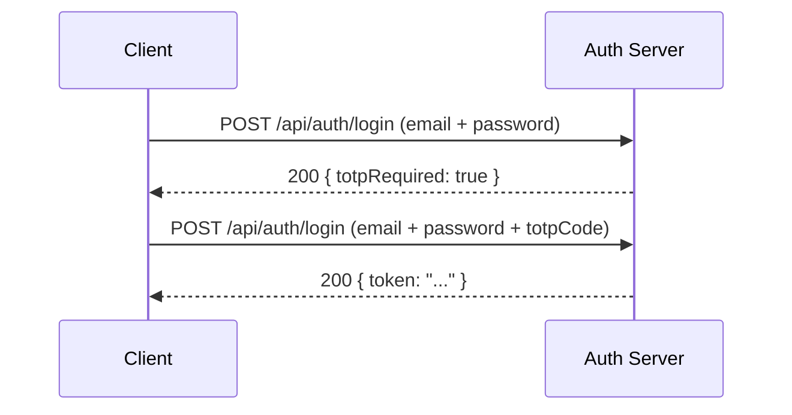

## POST /api/auth/login

Authenticates a user and returns a JWT token. Supports TOTP-based two-factor authentication.

### Request

<ParamField body="email" type="string" required>
  Registered email address.
</ParamField>

<ParamField body="password" type="string" required>
  Account password.
</ParamField>

<ParamField body="totpCode" type="string">
  Six-digit TOTP code from an authenticator app. Required if 2FA is enabled on the account.
</ParamField>

<ParamField body="backupCode" type="string">
  One-time backup code. Use this instead of `totpCode` if the authenticator app is unavailable.
</ParamField>

<CodeGroup>
```bash cURL (without 2FA)
curl -X POST http://localhost:3000/api/auth/login \
  -H "Content-Type: application/json" \
  -d '{
    "email": "user@example.com",
    "password": "secureP@ssw0rd"
  }'
```

```bash cURL (with 2FA)
curl -X POST http://localhost:3000/api/auth/login \
  -H "Content-Type: application/json" \
  -d '{
    "email": "user@example.com",
    "password": "secureP@ssw0rd",
    "totpCode": "482917"
  }'
```

```bash cURL (with backup code)
curl -X POST http://localhost:3000/api/auth/login \
  -H "Content-Type: application/json" \
  -d '{
    "email": "user@example.com",
    "password": "secureP@ssw0rd",
    "backupCode": "a1b2c3d4e5"
  }'
```
</CodeGroup>

### Response

<Tabs>
  <Tab title="200 Success">
    ```json
    {
      "ok": true,
      "data": {
        "user": {
          "id": "usr_a1b2c3d4e5f6",
          "email": "user@example.com",
          "name": "Alice Chen",
          "totpEnabled": false
        },
        "token": "eyJhbGciOiJIUzI1NiIsInR5cCI6IkpXVCJ9...",
        "expiresAt": "2026-03-08T12:00:00.000Z"
      }
    }
    ```
  </Tab>
  <Tab title="200 2FA Required">
    When the account has TOTP enabled but no code was provided:

    ```json
    {
      "ok": false,
      "error": "2FA_REQUIRED",
      "totpRequired": true
    }
    ```

    Resubmit the request with the `totpCode` or `backupCode` field included.
  </Tab>
  <Tab title="401 Invalid Credentials">
    ```json
    {
      "ok": false,
      "error": "Invalid email or password"
    }
    ```
  </Tab>
</Tabs>

### Two-Factor Authentication Flow

When 2FA is enabled on an account, the login process requires two steps:



<Info>
The `totpCode` and `backupCode` fields are mutually exclusive. Provide one or the other, not both. Backup codes are single-use and are consumed upon successful authentication.
</Info>

### Token Lifetime

JWT tokens expire after **24 hours** by default. The `expiresAt` field indicates the exact expiration timestamp. To maintain a session, re-authenticate before the token expires.

<Tip>
The CLI (`panguard login`) handles the full login flow automatically, including 2FA prompts and secure token storage in `~/.panguard/credentials.json`.
</Tip>
