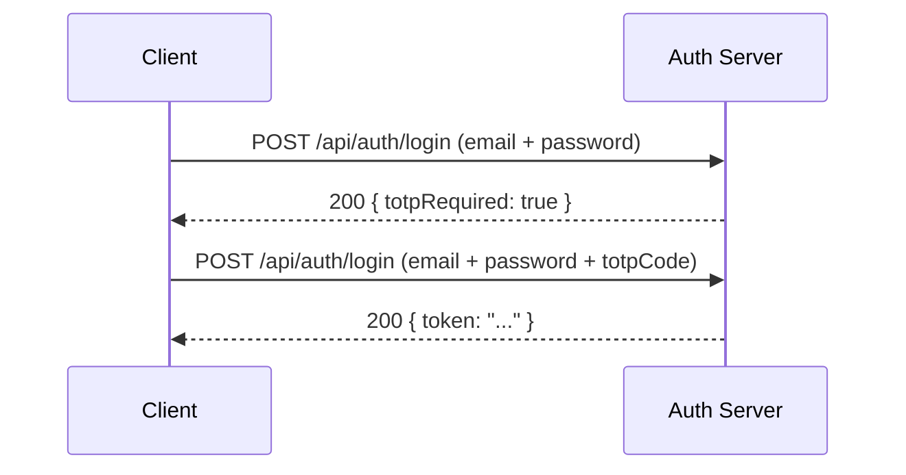

## POST /api/auth/login

驗證使用者身份並回傳 JWT token。支援基於 TOTP 的雙因素驗證。

### 請求

<ParamField body="email" type="string" required>
  已註冊的 email 地址。
</ParamField>

<ParamField body="password" type="string" required>
  帳號密碼。
</ParamField>

<ParamField body="totpCode" type="string">
  來自驗證器 app 的六位數 TOTP 代碼。如果帳號已啟用 2FA 則為必填。
</ParamField>

<ParamField body="backupCode" type="string">
  一次性備用代碼。當驗證器 app 無法使用時，可替代 `totpCode` 使用。
</ParamField>

<CodeGroup>
```bash cURL（無 2FA）
curl -X POST http://localhost:3000/api/auth/login \
  -H "Content-Type: application/json" \
  -d '{
    "email": "user@example.com",
    "password": "secureP@ssw0rd"
  }'
```

```bash cURL（有 2FA）
curl -X POST http://localhost:3000/api/auth/login \
  -H "Content-Type: application/json" \
  -d '{
    "email": "user@example.com",
    "password": "secureP@ssw0rd",
    "totpCode": "482917"
  }'
```

```bash cURL（使用備用代碼）
curl -X POST http://localhost:3000/api/auth/login \
  -H "Content-Type: application/json" \
  -d '{
    "email": "user@example.com",
    "password": "secureP@ssw0rd",
    "backupCode": "a1b2c3d4e5"
  }'
```
</CodeGroup>

### 回應

<Tabs>
  <Tab title="200 成功">
    ```json
    {
      "ok": true,
      "data": {
        "user": {
          "id": "usr_a1b2c3d4e5f6",
          "email": "user@example.com",
          "name": "Alice Chen",
          "totpEnabled": false
        },
        "token": "eyJhbGciOiJIUzI1NiIsInR5cCI6IkpXVCJ9...",
        "expiresAt": "2026-03-08T12:00:00.000Z"
      }
    }
    ```
  </Tab>
  <Tab title="200 需要 2FA">
    當帳號已啟用 TOTP 但未提供代碼時：

    ```json
    {
      "ok": false,
      "error": "2FA_REQUIRED",
      "totpRequired": true
    }
    ```

    請重新提交請求，包含 `totpCode` 或 `backupCode` 欄位。
  </Tab>
  <Tab title="401 無效的憑證">
    ```json
    {
      "ok": false,
      "error": "Invalid email or password"
    }
    ```
  </Tab>
</Tabs>

### 雙因素驗證流程

當帳號啟用 2FA 時，登入過程需要兩個步驟：



<Info>
`totpCode` 和 `backupCode` 欄位互斥。請提供其中一個，而非兩個都提供。備用代碼為一次性使用，成功驗證後即被消耗。
</Info>

### Token 有效期

JWT token 預設在 **24 小時**後到期。`expiresAt` 欄位指示確切的到期時間戳。若要維持工作階段，請在 token 到期前重新驗證。

<Tip>
CLI（`panguard login`）會自動處理完整的登入流程，包括 2FA 提示和安全 token 儲存於 `~/.panguard/credentials.json`。
</Tip>
