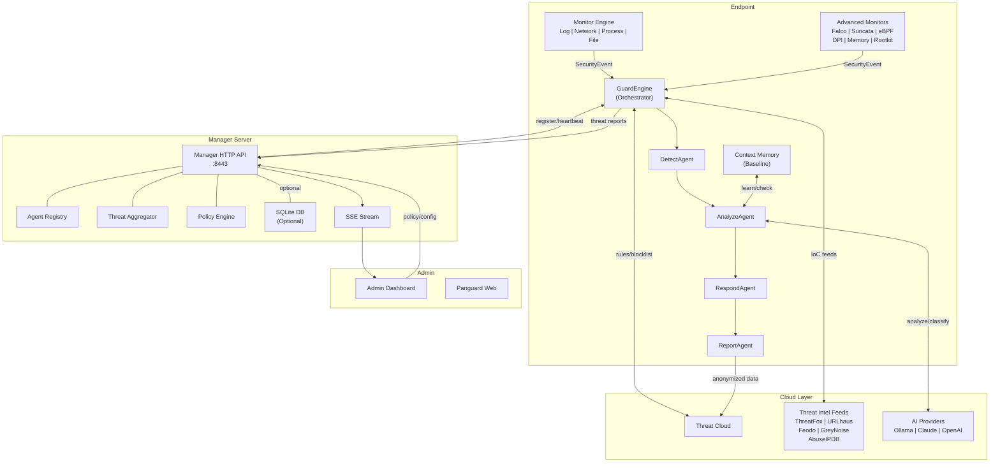
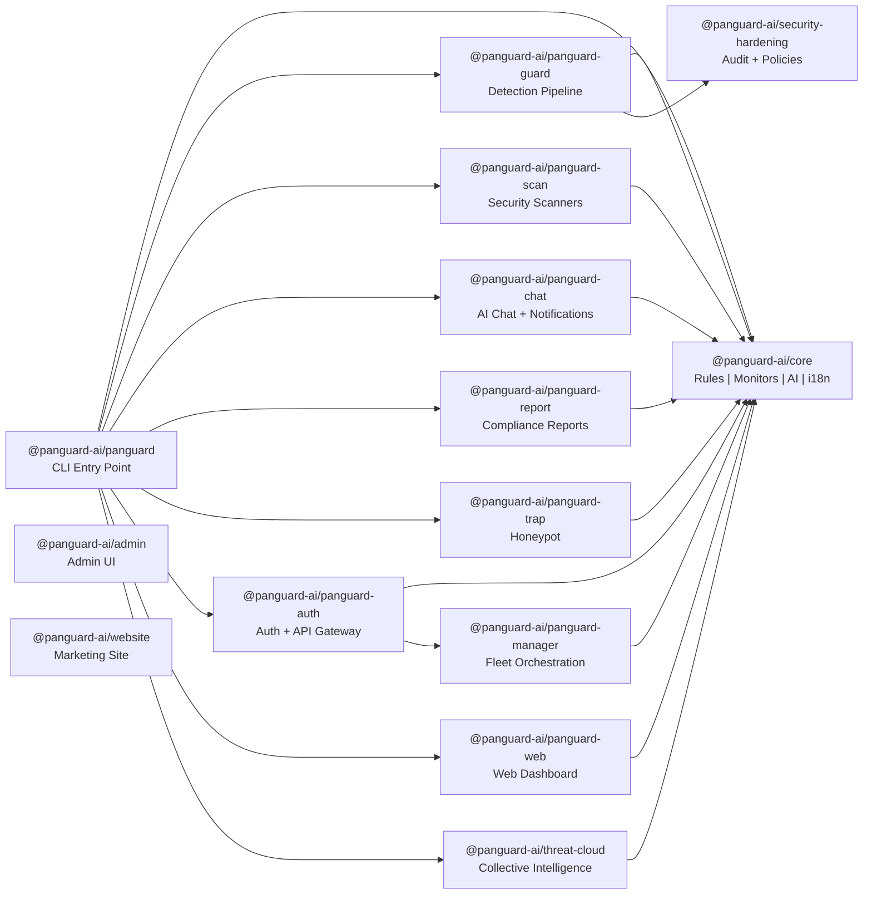
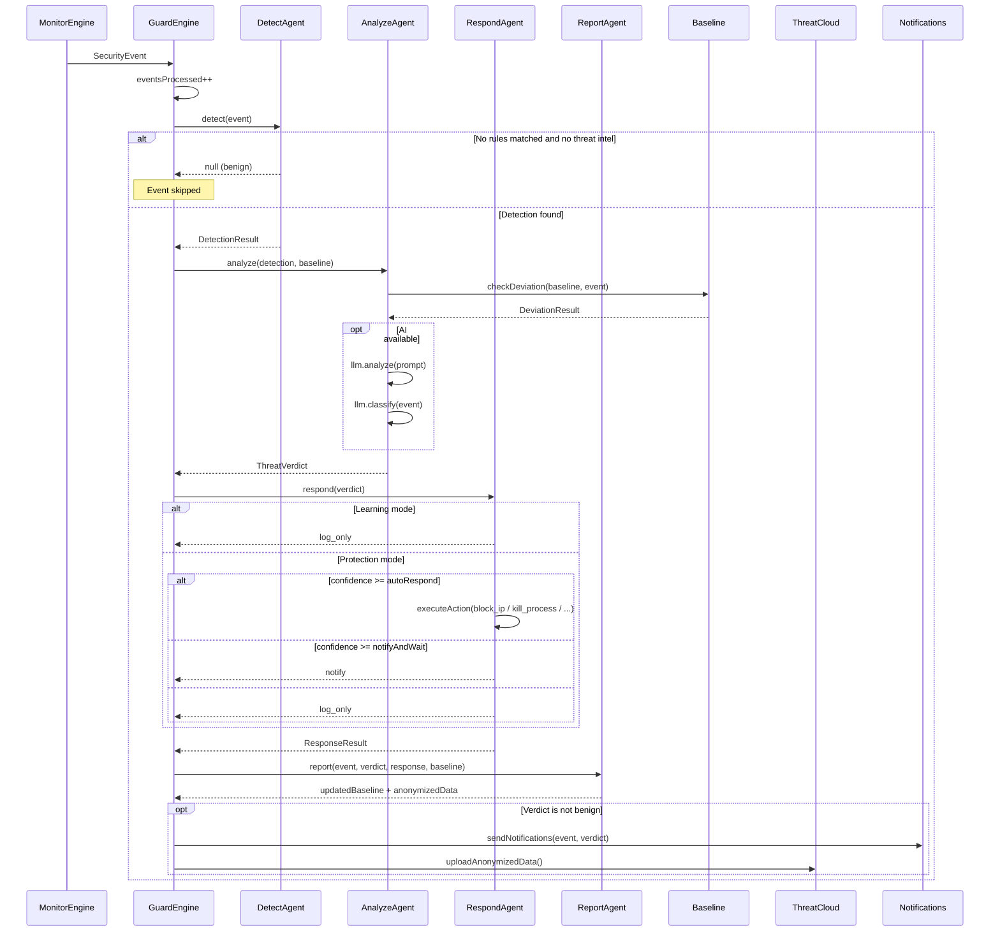
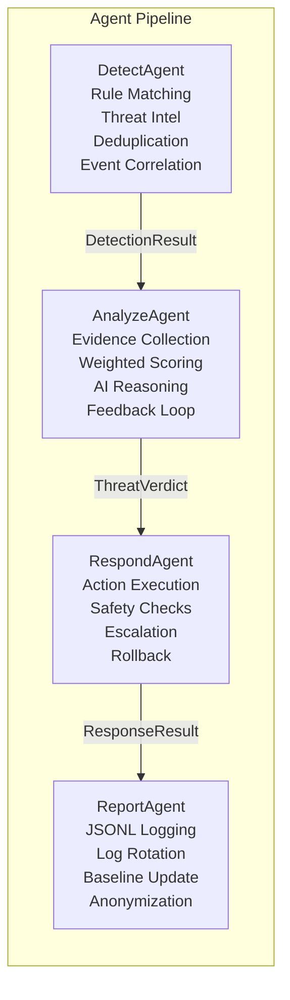
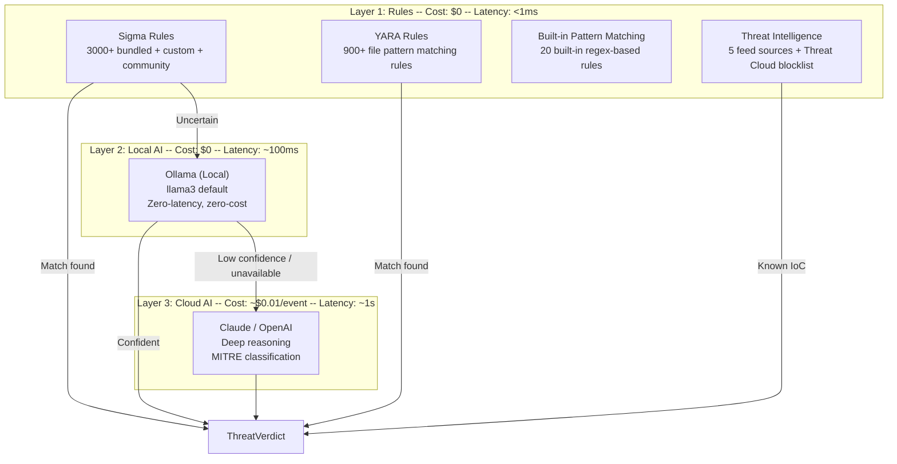
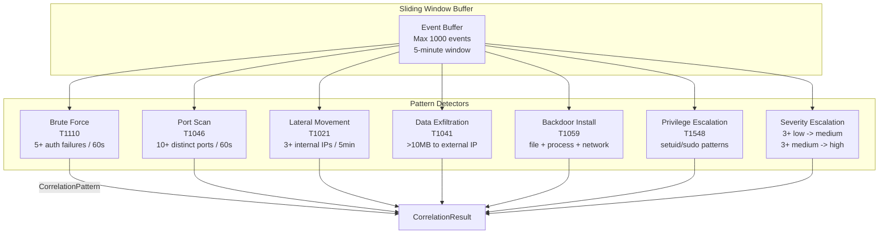
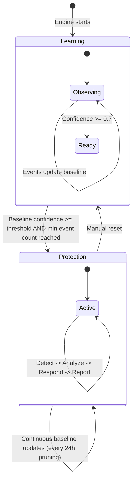

# System Architecture

> Comprehensive technical architecture documentation for the Panguard AI platform.

## Table of Contents

- [High-Level Overview](#high-level-overview)
- [13-Package Monorepo Structure](#13-package-monorepo-structure)
- [Data Flow: Detection Pipeline](#data-flow-detection-pipeline)
- [Four-Agent Pipeline: Detect -> Analyze -> Respond -> Report](#four-agent-pipeline)
- [Three-Layer AI Detection Funnel](#three-layer-ai-detection-funnel)
- [Event Correlation Engine](#event-correlation-engine)
- [Distributed Manager-Agent Architecture](#distributed-manager-agent-architecture)
- [10 Monitor Types](#10-monitor-types)
- [Component Interaction Map](#component-interaction-map)
- [Mode Transitions](#mode-transitions)
- [Technology Stack](#technology-stack)

---

## High-Level Overview

Panguard AI is a monorepo-based cybersecurity platform built with Node.js 20+, TypeScript, and pnpm workspaces. It operates across three deployment layers: a local Guard agent running on each endpoint, a centralized Manager for fleet orchestration, and a cloud layer for threat intelligence sharing and AI-assisted analysis.



---

## 13-Package Monorepo Structure

The monorepo is organized under `packages/` with a shared `@panguard-ai/core` foundation. The `security-hardening` module is referenced at the repository root level.



### Package Summary

| #   | Package            | npm Scope                       | Key Responsibilities                                                                                                                                                            |
| --- | ------------------ | ------------------------------- | ------------------------------------------------------------------------------------------------------------------------------------------------------------------------------- |
| 1   | `core`             | `@panguard-ai/core`             | Rule engine, monitor engine, AI providers (Ollama/Claude/OpenAI), FunnelRouter, YARA scanner, threat intel feed manager, i18n, structured logger                                |
| 2   | `panguard-guard`   | `@panguard-ai/panguard-guard`   | 4-agent pipeline, event correlation, baseline memory, 6 advanced monitors, response execution, dashboard server, agent client                                                   |
| 3   | `panguard-manager` | `@panguard-ai/panguard-manager` | Agent registry (max 500), threat aggregation with cross-agent correlation, policy engine, SSE broadcasting, optional SQLite persistence                                         |
| 4   | `panguard-auth`    | `@panguard-ai/panguard-auth`    | User registration, login, TOTP 2FA, Google OAuth, password reset, rate limiting, GDPR (delete/export), admin routes, usage metering, LemonSqueezy billing                       |
| 5   | `panguard-scan`    | `@panguard-ai/panguard-scan`    | CVE checker, SSL/TLS scanner, open port scanner, password policy auditor, shared folder scanner, scheduled tasks scanner, remote scanning, PDF report generation                |
| 6   | `panguard-chat`    | `@panguard-ai/panguard-chat`    | Multi-channel notifications (Telegram, Slack, Email, LINE, Webhook), AI chat agent, user-type tone adaptation (developer/boss/IT admin), confirmation flows, follow-up Q&A      |
| 7   | `panguard-report`  | `@panguard-ai/panguard-report`  | Compliance report generation (Taiwan Cyber Security Act, ISO 27001, SOC 2), PDF/JSON output, control evaluation, finding mapping, executive summaries                           |
| 8   | `panguard-trap`    | `@panguard-ai/panguard-trap`    | 8 honeypot service types (SSH, HTTP, FTP, SMB, MySQL, RDP, Telnet, Redis), attacker profiling, skill level assessment, Threat Cloud intel upload                                |
| 9   | `panguard-web`     | `@panguard-ai/panguard-web`     | Real-time web dashboard for guard status and threat visualization                                                                                                               |
| 10  | `threat-cloud`     | `@panguard-ai/threat-cloud`     | IoC store, correlation engine, campaign tracking, feed distribution (IP/domain blocklists), sighting store, reputation engine, Sigma rule sharing, audit logging                |
| 11  | `panguard`         | `@panguard-ai/panguard`         | CLI entry point with 19 commands: scan, guard, chat, report, trap, serve, manager, login, logout, whoami, config, init, status, deploy, hardening, admin, threat, upgrade, demo |
| 12  | `admin`            | `@panguard-ai/admin`            | Static admin dashboard UI served by the API server                                                                                                                              |
| 13  | `website`          | `@panguard-ai/website`          | Next.js marketing website (separate from platform)                                                                                                                              |

Additionally, `security-hardening` (`@panguard-ai/security-hardening`) provides policy enforcement, security self-audit, syslog forwarding, and audit event logging.

---

## Data Flow: Detection Pipeline

The core detection pipeline processes every security event through a linear 4-agent chain. The `GuardEngine` in `packages/panguard-guard/src/guard-engine.ts` orchestrates this flow.



### Event Processing Detail

1. **Monitor Layer**: The `MonitorEngine` (from `@panguard-ai/core`) runs 4 built-in sub-monitors (Log, Network, Process, File) plus 6 optional advanced monitors (Falco, Suricata, eBPF, Memory Scanner, DPI, Rootkit Detector). All emit normalized `SecurityEvent` objects.

2. **Detection**: `DetectAgent` runs the event through Sigma rules, checks threat intelligence feeds, deduplicates (60s window), and correlates via both legacy IP-based correlation and the advanced `EventCorrelator` (7 attack patterns).

3. **Analysis**: `AnalyzeAgent` collects evidence from multiple sources (rule matches, threat intel, baseline deviation, Falco/Suricata, attack chain, AI analysis), calculates a weighted confidence score (0-100), and produces a `ThreatVerdict` with conclusion (benign/suspicious/malicious) and recommended action.

4. **Response**: `RespondAgent` executes the appropriate action based on confidence thresholds, the configured `ActionPolicy`, and escalation state. Actions include `block_ip`, `kill_process`, `disable_account`, `isolate_file`, `notify`, and `log_only`. All actions are persisted to a manifest for rollback support.

5. **Reporting**: `ReportAgent` logs the complete record to JSONL with rotation (50MB, 10 files, 90-day retention), updates the baseline during learning mode, and generates anonymized threat data for the Threat Cloud.

---

## Four-Agent Pipeline

The detection pipeline is composed of four specialized agents, each with a single responsibility. This design follows the principle of separation of concerns and allows each stage to evolve independently.



### DetectAgent

**Source**: `packages/panguard-guard/src/agent/detect-agent.ts`

- **Input**: `SecurityEvent`
- **Output**: `DetectionResult | null`
- **Responsibilities**:
  - Match events against loaded Sigma rules via the `RuleEngine`
  - Check threat intelligence (IP lookup for network/suricata events, supporting IPv4 and IPv6)
  - Deduplication: skip identical detections within a 60-second window (max 500 entries)
  - Legacy IP-based correlation: flag attack chains when 3+ events from the same source IP occur within 5 minutes
  - Advanced pattern-based correlation via `EventCorrelator` (7 attack patterns with MITRE ATT&CK mapping)
- **State**: Correlation buffer (1000 events), dedup map (500 entries)

### AnalyzeAgent

**Source**: `packages/panguard-guard/src/agent/analyze-agent.ts`

- **Input**: `DetectionResult` + `EnvironmentBaseline`
- **Output**: `ThreatVerdict`
- **Evidence Sources** (weighted):
  - Sigma rule matches (weight: 0.4) with feedback adjustment
  - Threat intelligence (confidence: 85 if matched)
  - Baseline deviation (weight: 0.3) with time-of-day awareness (0:00-5:59 boost)
  - Falco/Suricata kernel-level evidence (weight: 0.2-0.25 when present)
  - Attack chain correlation boost (+5 per event, max +25)
  - AI analysis (weight: 0.3 when available)
- **Feedback Loop**: Records false positive / true positive feedback per rule, adjusting confidence by up to -30% (high FP rate) or +10% (high TP rate)
- **Contradiction Detection**: If a high-severity rule matches but baseline shows no deviation, confidence is reduced by 10 points

### RespondAgent

**Source**: `packages/panguard-guard/src/agent/respond-agent.ts`

- **Input**: `ThreatVerdict`
- **Output**: `ResponseResult`
- **Actions**: `block_ip`, `kill_process`, `disable_account`, `isolate_file`, `notify`, `log_only`
- **Safety Rules**:
  - Whitelisted IPs: `127.0.0.1`, `::1`, `localhost`, `0.0.0.0` (plus user-configured)
  - Protected processes: `sshd`, `systemd`, `init`, `launchd`, `node`, `panguard-guard`, etc.
  - Protected accounts: `root`, `Administrator`, `SYSTEM`, `LocalSystem`, `admin`
  - Network isolation requires confidence >= 95
  - Self-process kill prevention
- **Escalation Ladder**:
  - 3+ violations from same target: lower auto-respond threshold by 10%
  - Repeat offenders: 24-hour block duration (vs. default 1 hour)
- **Persistence**: Action manifest in JSONL (`/var/panguard-guard/action-manifest.jsonl`) supports rollback
- **Process Termination**: SIGTERM first, then SIGKILL after 5-second timeout
- **Cross-Platform**: macOS (pfctl), Linux (iptables), Windows (netsh)
- **Auto-Unblock**: Blocked IPs are automatically unblocked after the configured duration

### ReportAgent

**Source**: `packages/panguard-guard/src/agent/report-agent.ts`

- **Input**: `SecurityEvent` + `ThreatVerdict` + `ResponseResult` + `EnvironmentBaseline`
- **Output**: Updated baseline + optional anonymized threat data
- **Log Rotation**: Max 50MB per file, max 10 rotated files, 90-day retention
- **Streaming Reader**: Memory-efficient line-by-line JSONL reader for summary generation
- **Anonymization**: IP addresses are /16-anonymized (last two octets zeroed for IPv4)
- **Summary Generation**: Daily (24h) and weekly (7d) summaries with top attack sources, action breakdown, verdict distribution

---

## Three-Layer AI Detection Funnel

Panguard uses a cascading "funnel" approach for AI-assisted analysis, reducing latency and cost by only escalating to more expensive analysis tiers when needed.



### FunnelRouter

The `FunnelRouter` (in `@panguard-ai/core`) implements Layer 2 -> Layer 3 fallback:

1. Try **Ollama** (local) first for analysis
2. If Ollama is unavailable or returns low confidence, fall back to **Claude/OpenAI** (cloud)
3. If no AI provider is available, the system continues with rule-based scoring only (weights shift to 0.6 rules + 0.4 baseline)

**Provider Auto-Detection** (in `guard-engine.ts`):

1. Check `~/.panguard/llm.enc` (encrypted local config, AES-256-GCM)
2. Check environment variables: `ANTHROPIC_API_KEY`, `OPENAI_API_KEY`
3. Probe local Ollama at `http://localhost:11434`
4. Build appropriate adapter: FunnelRouter (both available), single provider, or null

**Confidence Weighting** varies by available sources:

| Sources Available | Rule/Intel | Baseline | AI   | eBPF |
| ----------------- | ---------- | -------- | ---- | ---- |
| Rules only        | 0.60       | 0.40     | --   | --   |
| Rules + AI        | 0.40       | 0.30     | 0.30 | --   |
| Rules + eBPF      | 0.40       | 0.35     | --   | 0.25 |
| Rules + AI + eBPF | 0.30       | 0.20     | 0.30 | 0.20 |

---

## Event Correlation Engine

The `EventCorrelator` (`packages/panguard-guard/src/correlation/event-correlator.ts`) implements real-time pattern-based multi-step attack detection using a sliding time window.



### 7 Correlation Patterns

| Pattern              | MITRE ID | Detection Logic                                  | Window | Threshold | Confidence Range   |
| -------------------- | -------- | ------------------------------------------------ | ------ | --------- | ------------------ |
| Brute Force          | T1110    | Auth failures from same source IP                | 60s    | 5 events  | 60-100 (+8/event)  |
| Port Scan            | T1046    | Distinct destination ports from same IP          | 60s    | 10 ports  | 65-100 (+3/port)   |
| Lateral Movement     | T1021    | Connections to distinct internal (RFC 1918) IPs  | 5 min  | 3 IPs     | 55-100 (+10/IP)    |
| Data Exfiltration    | T1041    | Large outbound transfer to external IP           | single | 10 MB     | 50-100 (+15/10MB)  |
| Backdoor Install     | T1059    | File write + process creation + outbound network | 5 min  | all 3     | 55-100             |
| Privilege Escalation | T1548    | setuid/setgid/sudo/pkexec events                 | 5 min  | 1+ events | 50-100 (+15/event) |
| Severity Escalation  | --       | Compound low or medium events from same source   | 5 min  | 3 events  | 40-100 (+10/event) |

---

## Distributed Manager-Agent Architecture

In distributed deployments, multiple Guard agents report to a centralized Manager server. The Manager provides fleet-wide visibility, cross-agent correlation, and centralized policy distribution.

```mermaid
graph TB
    subgraph Fleet["Guard Agent Fleet"]
        G1["Guard Agent 1<br/>web-server-01"]
        G2["Guard Agent 2<br/>db-server-01"]
        G3["Guard Agent 3<br/>app-server-01"]
        G4["Guard Agent N<br/>..."]
    end

    subgraph ManagerCluster["Manager"]
        MGR["ManagerServer<br/>:8443"]
        REG["AgentRegistry<br/>Max 500 agents"]
        AGG["ThreatAggregator<br/>Cross-agent correlation"]
        POL["PolicyEngine<br/>Centralized rules"]
        MDB["ManagerDB<br/>(SQLite, optional)"]
    end

    subgraph AdminUI["Admin"]
        DASH["Admin Dashboard"]
        API["REST API Client"]
    end

    G1 -->|POST /api/agents/register| MGR
    G1 -->|POST /api/agents/:id/heartbeat| MGR
    G1 -->|POST /api/agents/:id/events| MGR
    G2 -->|register/heartbeat/events| MGR
    G3 -->|register/heartbeat/events| MGR
    G4 -->|register/heartbeat/events| MGR

    MGR --- REG
    MGR --- AGG
    MGR --- POL
    MGR ---|optional| MDB

    MGR -->|GET /api/events/stream (SSE)| DASH
    DASH -->|POST /api/policy| MGR
    API -->|REST API| MGR

    MGR -->|Policy distribution| G1
    MGR -->|Policy distribution| G2
    MGR -->|Policy distribution| G3
```

### Agent Lifecycle

1. **Registration**: Guard agent sends `POST /api/agents/register` with hostname, OS, architecture, version, and optional organization ID. Receives a unique `agentId`.
2. **Heartbeat**: Every 30 seconds (default), each agent sends `POST /api/agents/:id/heartbeat` with CPU/memory usage, events processed, mode, and uptime.
3. **Stale Detection**: Manager checks every 30 seconds for agents that have not sent a heartbeat within 90 seconds. Stale agents are flagged but not removed.
4. **Threat Reporting**: When a Guard agent detects threats, it sends `POST /api/agents/:id/events`. The `ThreatAggregator` correlates threats across agents by source IP, malware hash, and attack pattern.
5. **Policy Polling**: Guard agents poll `GET /api/policy/agent/:id` every 5 minutes. Policy changes can adjust action thresholds, add IP blocklists, or modify alerting rules.
6. **Deregistration**: `DELETE /api/agents/:id` removes an agent from the fleet.

### Manager Components

| Component          | Source File            | Responsibility                                                                                                 |
| ------------------ | ---------------------- | -------------------------------------------------------------------------------------------------------------- |
| `Manager`          | `manager.ts`           | Central orchestrator composing registry, aggregator, and policy engine                                         |
| `AgentRegistry`    | `agent-registry.ts`    | Agent CRUD, heartbeat tracking, stale detection, max 500 agents                                                |
| `ThreatAggregator` | `threat-aggregator.ts` | Threat ingestion, cross-agent correlation (5-min window), 24-hour retention                                    |
| `PolicyEngine`     | `policy-engine.ts`     | Policy versioning, per-agent and global policies, broadcast queue                                              |
| `ManagerServer`    | `server.ts`            | HTTP API (raw `node:http`), Bearer token auth (SHA-256 timing-safe), rate limiting (60 req/min), SSE streaming |
| `ManagerDB`        | `db.ts`                | Optional SQLite persistence for org-scoped queries                                                             |

---

## 10 Monitor Types

The Guard agent supports 10 monitor types across two tiers: 4 built-in monitors available on all platforms, and 6 advanced monitors that require specific OS or tool dependencies.

### Built-in Monitors (from `@panguard-ai/core`)

| Monitor             | Source          | Capabilities                                                                                                                                     |
| ------------------- | --------------- | ------------------------------------------------------------------------------------------------------------------------------------------------ |
| **Log Monitor**     | `core/monitors` | Reads syslog, Windows Event Log, and application log files. Normalizes entries to `SecurityEvent` format.                                        |
| **Network Monitor** | `core/monitors` | Monitors network connections via `/proc/net/tcp` (Linux) or `netstat`. Detects new connections, unusual ports, and traffic patterns.             |
| **Process Monitor** | `core/monitors` | Scans running processes via `/proc` (Linux) or OS APIs. Detects new/unusual process spawning.                                                    |
| **File Monitor**    | `core/monitors` | Watches critical filesystem paths for modifications using inotify (Linux) or FSEvents (macOS). Tracks file creation, modification, and deletion. |

### Advanced Monitors (from `@panguard-ai/panguard-guard`)

| Monitor              | Source File           | Dependencies       | Capabilities                                                                                                                       |
| -------------------- | --------------------- | ------------------ | ---------------------------------------------------------------------------------------------------------------------------------- |
| **Falco Monitor**    | `falco-monitor.ts`    | Falco >= 0.35      | Reads Falco alerts from `/var/log/falco/alerts.json`. Detects container escapes, privilege escalation, anomalous system calls.     |
| **Suricata Monitor** | `suricata-monitor.ts` | Suricata >= 7.0    | Reads Suricata EVE JSON from `/var/log/suricata/eve.json`. Network IDS with protocol-aware deep packet analysis.                   |
| **Syscall Monitor**  | `syscall-monitor.ts`  | Linux Kernel 4.18+ | Process and network activity monitoring via /proc polling. Detects suspicious processes, privilege escalation, and C2 connections. |
| **Memory Scanner**   | `memory-scanner.ts`   | `CAP_SYS_PTRACE`   | Scans process memory for fileless malware signatures, injected code, and suspicious memory regions.                                |
| **DPI Monitor**      | `dpi-monitor.ts`      | None (userspace)   | Deep Packet Inspection for protocol analysis. Detects C2 beacons, DNS tunneling, and encrypted traffic anomalies.                  |
| **Rootkit Detector** | `rootkit-detector.ts` | Linux              | Checks for hidden processes, hidden kernel modules, modified system binaries, and LD_PRELOAD injections.                           |

All advanced monitors gracefully degrade when their dependencies are not installed.

---

## Component Interaction Map

```mermaid
graph TB
    subgraph CorePkg["@panguard-ai/core"]
        RE["RuleEngine<br/>Sigma + Built-in"]
        ME["MonitorEngine<br/>Log | Net | Proc | File"]
        YS["YaraScanner"]
        TIF["ThreatIntelFeedManager<br/>5 feeds"]
        LLM_CORE["LLM Providers<br/>Ollama | Claude | OpenAI"]
        FR["FunnelRouter<br/>Local-first AI fallback"]
    end

    subgraph GuardPkg["@panguard-ai/panguard-guard"]
        GE2["GuardEngine"]
        DA2["DetectAgent"]
        AA2["AnalyzeAgent"]
        RA2["RespondAgent"]
        REP2["ReportAgent"]
        EC["EventCorrelator"]
        BL2["Baseline Memory"]
        INV["InvestigationEngine"]
        FM["FalcoMonitor"]
        SM["SuricataMonitor"]
        EM["SyscallMonitor"]
        MS2["MemoryScanner"]
        DPI["DpiMonitor"]
        RD["RootkitDetector"]
        AC["AgentClient"]
        DASH2["DashboardServer"]
        NF["Notifications"]
        TCC["ThreatCloudClient"]
    end

    GE2 --> RE
    GE2 --> ME
    GE2 --> YS
    GE2 --> TIF
    GE2 --> DA2
    GE2 --> AA2
    GE2 --> RA2
    GE2 --> REP2
    DA2 --> RE
    DA2 --> EC
    DA2 --> TIF
    AA2 --> BL2
    AA2 --> FR
    GE2 --> FM
    GE2 --> SM
    GE2 --> EM
    GE2 --> MS2
    GE2 --> DPI
    GE2 --> RD
    GE2 --> AC
    GE2 --> DASH2
    GE2 --> NF
    GE2 --> TCC
    GE2 --> INV
```



**Key Interactions**:

- **GuardEngine** is the central orchestrator that wires everything together
- **DetectAgent** depends on `RuleEngine` (from core) and its internal `EventCorrelator`
- **AnalyzeAgent** depends on `Baseline Memory` for deviation checks and `FunnelRouter` for AI analysis
- **RespondAgent** is self-contained with cross-platform OS command execution via `execFile` (never `exec`)
- **ReportAgent** depends on `Baseline Memory` for learning-mode updates
- All advanced monitors gracefully degrade when their dependencies are not installed
- **AgentClient** is activated only when `managerUrl` is configured, enabling distributed mode
- **ThreatCloudClient** handles bidirectional sync: uploading anonymized data and downloading rules/blocklists

---

## Mode Transitions



The Guard operates in two modes:

1. **Learning Mode**: Collects baseline patterns (normal processes, connections, logins, ports). No active responses are taken. The `ReportAgent` continuously updates the baseline with each event. The baseline tracks process patterns, connection patterns, login patterns, and service port patterns.
2. **Protection Mode**: Active threat detection and response. Baseline is used for deviation checking. Stale patterns are pruned every 24 hours (30-day retention). Continuous baseline updates ensure the system adapts to evolving normal behavior.

---

## Technology Stack

| Layer           | Technology                                  |
| --------------- | ------------------------------------------- |
| Language        | TypeScript 5.7, Node.js 22                  |
| Package Manager | pnpm 9+ with workspaces                     |
| Build           | esbuild (via tsx), TypeScript compiler      |
| Testing         | Vitest with coverage-v8                     |
| Linting         | ESLint 9 with security plugin, Prettier     |
| HTTP Server     | Raw `node:http` (no framework dependency)   |
| Database        | better-sqlite3 (optional)                   |
| Container       | Docker multi-stage build, tini for PID 1    |
| AI              | Ollama (local), Claude, OpenAI (cloud)      |
| Rules           | Sigma (YAML), YARA (native + fallback)      |
| Monitoring      | Falco, Suricata, eBPF, /proc filesystem     |
| Notifications   | Telegram, Slack, Email, LINE, Webhook       |
| Compliance      | Taiwan Cyber Security Act, ISO 27001, SOC 2 |
